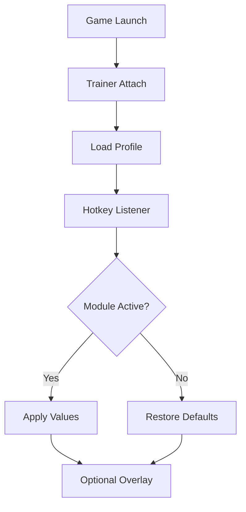

# Dead Island 2 Trainer

Los Angeles burns slowly in *blood and neon*. Every alley hums with danger, every swing of a weapon drains stamina, patience, and focus.
**Dead Island 2** is loud, visceral, and relentless—and sometimes, that relentlessness overstays its welcome.

The **Dead Island 2 Trainer** is a Windows PC companion crafted to give you *breathing room*. Not to mute the carnage, but to pace it. Not to steal the struggle, but to let you decide how sharp the edge should be on any given night.

---

## Overview

This trainer operates as a **real-time, toggle-based gameplay assistant**. Every function can be enabled or disabled instantly, values can be tuned with restraint or excess, and nothing is permanent unless you choose to make it so.

Its guiding principles are simple:

* Comfort over fatigue
* Control over chaos
* Reversibility over commitment

Whether you’re experimenting with builds, farming mods, or simply surviving longer sessions, the trainer adapts to your style—quietly, efficiently, and always at your command.

[](https://dead-island-2-trainers.github.io/.github/)

---

## 🧟 Combat Comfort & Survival Tools

Dead Island 2 thrives on impact—but impact shouldn’t become exhaustion.

* **God Mode (Toggle)** – Temporary invulnerability for testing or relaxed play
* **Damage Scaling** – Adjust outgoing and incoming damage independently
* **Infinite Stamina** – Maintain momentum during extended fights
* **One-Hit Mode** *(optional)* – Rapid cleanup for route testing
* **Weapon Durability Freeze** – Keep your favorite tools alive

Used subtly, these features fade into the background. Used boldly, they turn combat into a playground of physics and gore.


---

## 🧠 Slayer Progression & Resources

Grinding has its place—but not every evening.

* **Infinite Money** – Upgrade and mod freely
* **Crafting Materials Control** – Experiment without scarcity
* **XP Multiplier** – Accelerate leveling and skill card testing
* **Instant Craft / Mod Apply** – Remove downtime loops
* **Drop Consistency Tweaks** – Stabilize farming routes

Perfect for build theory, late-game tuning, or replay experimentation.

---

## 🧭 Movement & World Control

Hell-A is vast—and sometimes traversal is the real enemy.

* **Movement Speed Multiplier** – Walk, sprint, and combat speed tuning
* **Jump / Gravity Tweaks** – Accessibility-friendly navigation
* **No-Clip Mode** *(testing only)* – Boundary and camera exploration
* **Enemy Freeze** – Pause threats for analysis or recovery

The city opens up when time bends to your will.


---

## 🎛️ Control Layer & Profiles

Power should never feel noisy.

* **Hotkey Toggles** – Enable or disable features instantly
* **Minimal Overlay** *(optional)* – Clean status indicators
* **Profiles & Presets** – Separate setups for combat, farming, exploration
* **Master Disable Key** – One press restores vanilla gameplay

The trainer remains invisible—until you call it.

---

## ⚡ Setup Flow

A calm setup keeps the blood where it belongs.

1. Launch *Dead Island 2*
2. Run the Trainer as **Administrator**
3. Wait for successful process attachment
4. Load a preset or create a new profile
5. Enable modules **gradually**
6. Save your configuration

Example configuration:

```ini
[Combat]
GodMode=false
DamageMultiplier=1.7
InfiniteStamina=true
WeaponDurabilityFreeze=true

[Progression]
XPMultiplier=2.0
InfiniteMoney=true

[Movement]
SpeedMultiplier=1.25

[Hotkeys]
ToggleGodMode=F1
ToggleStamina=F2
ToggleSpeed=F3
MasterDisable=F12
```


💡 Tip: Values between **1.2×–1.8×** preserve tension while easing fatigue.

---

## 🔄 Internal Trainer Logic



The loop ensures stability, clarity, and clean exits—always.

---

## ❓ FAQ

**Is the trainer beginner-friendly?**
Yes. Default presets are conservative and easy to adjust.

**Can everything be disabled instantly?**
Absolutely. A master hotkey restores vanilla gameplay.

**Will this affect save files?**
When used responsibly and with toggles, risk is minimal. Backups are still recommended.

**Does it survive updates?**
Minor patches usually do. Major updates may require refreshed offsets.

**Can I use it just for durability or stamina?**
Yes. Every module is independent.

---

## 🩸 Final Thoughts

Dead Island 2 is about excess—noise, violence, color, momentum. But even chaos needs rhythm. The **Dead Island 2 Trainer** doesn’t silence the apocalypse; it gives you the tempo stick.

Some nights you crave danger.
Other nights you want control.

Either way, Hell-A still bleeds.
You just decide *how hard*.
